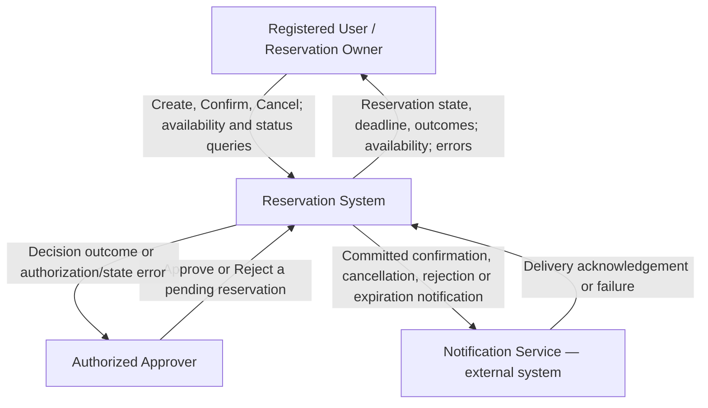
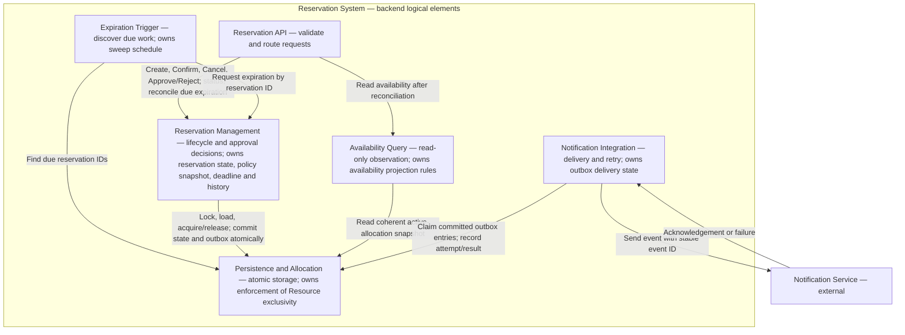
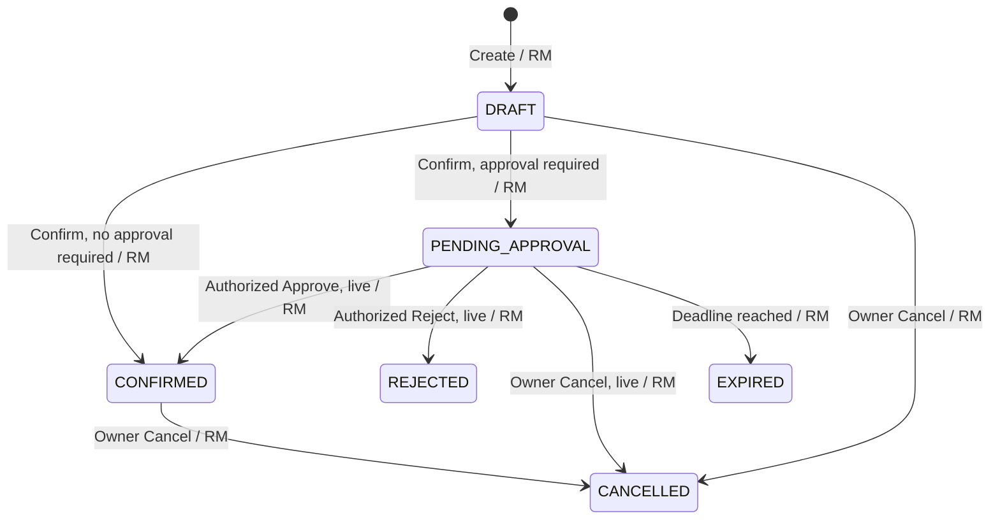
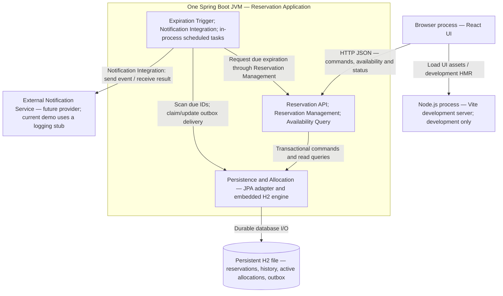

# C03 — Architecture

## B — Architectural Drivers

| Driver | Source | Why it affects the architecture | Question the architecture must answer |
|---|---|---|---|
| Atomic exclusive multi-seat allocation | BR-02, REQ-03, REQ-04 | Concurrent Confirm requests must not acquire the same Resource, and a multi-seat reservation must be allocated atomically without partial acquisition. | Where should the authoritative allocation decision be made so that BR-02 is preserved under concurrency? |
| Persistent delayed approval workflow | BR-07, BR-08, REQ-08–REQ-12 | A reservation may remain in PENDING_APPROVAL after the original request ends. The approval state, deadline, applicable policy and later decision must therefore persist across requests. | Who owns the pending approval state and performs later lifecycle transitions? |
| Reliable expiration and stale-decision protection | BR-06, BR-08, REQ-11 | A pending reservation must expire at its deadline and release its Resources. A delayed approval must not resurrect an expired or otherwise resolved reservation. | Who authoritatively determines expiration and how are stale approval decisions prevented from changing the reservation? |
| Lifecycle-aligned notifications | BR-09, Notification Service | Notifications are initiated only after successful lifecycle outcomes such as confirmation, cancellation, rejection or expiration. Failure of the external Notification Service must have clearly defined consequences. | Should notification failure affect a successful lifecycle transition, and who is responsible for delivery and retry? |


## C1 — Domain Model


## C2 — System Responsibilities

| Source | Responsibility | What it must decide / own | Needs one clear owner? | Reason |
|---|---|---|---|---|
| REQ-03, statechart | Manage reservation lifecycle | Valid reservation state transitions | Yes | Different parts of the system must not make conflicting lifecycle decisions |
| BR-02, REQ-04 | Evaluate allocation conflicts and preserve exclusive allocation | Resource acquisition/release and preservation of BR-02 | Yes | Concurrency must not cause double booking or partial multi-seat allocation |
| BR-07, REQ-08–REQ-10 | Manage approval decisions | Pending approval, authorization and approve/reject decisions | Yes | Approval is a delayed independent decision requiring clear authority |
| BR-08, REQ-11 | Manage pending expiration | Approval deadline and PENDING_APPROVAL → EXPIRED transition | Yes | Delayed processing must not allow late approval or an indefinite hold |
| REQ-02, BR-08 | Provide consistent Resource availability | AVAILABLE/UNAVAILABLE observation of active allocations | Yes | Availability must reflect pending holds, confirmed allocations and due expiration |
| BR-09 | Deliver lifecycle notifications | Notification delivery, failure handling and retry | According to design | External Notification Service failure must have explicitly defined consequences |

## D — Architecture Decision Question

**Decision question:**  
Where should the authoritative confirmation and Resource allocation decision be made so that BR-02 is preserved under concurrent Confirm requests?

## E1 — Architectural Alternatives

**Decision question:**  
Where should the authoritative confirmation and Resource allocation decision be made so that BR-02 is preserved under concurrent Confirm requests?

### Alternative A — Application-controlled allocation

The Reservation Application owns both the confirmation decision and the enforcement of exclusive Resource allocation. It checks for conflicts and performs the allocation and lifecycle transition within a transaction.

```text
[Client]
   |
   | Confirm Reservation
   v
+--------------------------------+
| Reservation Application        |
|                                |
| - confirmation decision        |
| - conflict check               |
| - Resource allocation          |
| - lifecycle transition         |
+---------------|----------------+
                |
                | read / write
                v
          [Database]
```

### Alternative B — Database-enforced exclusive allocation

The Reservation Application owns the confirmation workflow and reservation lifecycle, while the database is authoritative for enforcing exclusive Resource allocation. The application attempts to acquire the Resources atomically, and a conflicting acquisition is rejected by the database.

```text
[Client]
   |
   | Confirm Reservation
   v
+--------------------------------+
| Reservation Application        |
|                                |
| - confirmation workflow        |
| - lifecycle transition         |
+---------------|----------------+
                |
                | atomic allocation attempt
                v
+--------------------------------+
| Database                       |
|                                |
| - enforce Resource exclusivity |
| - reject conflicting acquire   |
+--------------------------------+
```
### E2 — Alternative Comparison

| Driver / Criterion | Alternative A — Application-controlled allocation | Alternative B — Database-enforced allocation |
|---|---|---|
| Atomic exclusive multi-seat allocation | The application checks conflicts and performs allocation in a transaction. Correctness therefore depends on the application using appropriate transaction isolation or locking for every allocation path. | The database enforces exclusive acquisition of Resources. Concurrent conflicting attempts cannot both successfully persist an active allocation. |
| Concurrency / BR-02 preservation | A read-then-write implementation can violate BR-02 unless concurrent Confirm requests are explicitly synchronized or locked. | BR-02 is protected at the persistence boundary where concurrent writes meet; a losing acquisition is rejected and translated to `409 Conflict`. |
| Lifecycle ownership | Confirmation logic and allocation decisions remain primarily in application logic, keeping the business workflow in one place. | The application owns the reservation lifecycle, while the database owns enforcement of Resource exclusivity. The ownership boundary must therefore be explicit. |
| Implementation complexity | Business logic is easier to understand in the application, but correct concurrency handling requires careful transaction and locking logic. | Requires persistence constraints/locking and translation of database conflicts into domain/API outcomes, but reduces the risk that another application path bypasses the exclusivity rule. |

## E3 — Scenario Walkthrough

**Scenario:** Two conflicting `DRAFT` reservations attempt to confirm the same Resource concurrently (C02 verification scenario V-09).

**Complication:** Concurrent `Confirm Reservation` requests.

| Step / Event | Alternative A — Application-controlled allocation | Alternative B — Database-enforced allocation |
|---|---|---|
| Two conflicting Confirm requests start | Both requests enter the Reservation Application, which is responsible for checking Resource conflicts. | Both requests enter the Reservation Application and attempt to acquire the same Resource. |
| Both requests evaluate the Resource | The application must coordinate the concurrent conflict checks using an appropriate transaction/isolation or locking mechanism so that both requests cannot observe and acquire the Resource successfully. | Both requests may attempt the allocation, but the database enforces Resource exclusivity at the persistence boundary. |
| First request acquires the Resource | The application completes the atomic allocation and changes the winning reservation to `CONFIRMED` or `PENDING_APPROVAL`. | The database accepts the first atomic allocation and the application changes the winning reservation to `CONFIRMED` or `PENDING_APPROVAL`. |
| Second request attempts the conflicting acquisition | The application must detect the conflict under its concurrency mechanism and reject the request with `409 Conflict`. | The database rejects the conflicting acquisition; the application translates the conflict into `409 Conflict`. |
| Multi-seat reservation contains a conflict | The application transaction must ensure that no subset of the requested Resources remains allocated when one Resource conflicts. | The database-backed atomic operation/transaction must roll back the complete acquisition when any requested Resource conflicts. |
| Result | BR-02 is preserved if every allocation path correctly uses the required application transaction/locking strategy. | BR-02 is enforced at the persistence boundary; conflicting writes cannot both create active allocations. |

## F — Architecture Decision Record

### ADR-01 — Authoritative Resource Allocation under Concurrent Confirmation

**Context:**  
Concurrent `Confirm Reservation` requests may attempt to acquire the same Resource. The system must preserve BR-02 so that a Resource cannot belong to more than one active `PENDING_APPROVAL` or `CONFIRMED` reservation. Multi-seat allocation must also be atomic, with no partial acquisition.

**Drivers:**
- Atomic exclusive multi-seat allocation.
- Preservation of BR-02 under concurrent Confirm requests.
- Clear ownership of the confirmation and allocation decision.
- Protection against allocation conflicts across concurrent lifecycle operations.

**Alternative A — Application-controlled allocation:**  
The Reservation Application checks allocation conflicts and is responsible for coordinating concurrent Resource acquisition using application-controlled transaction/isolation or locking.

**Alternative B — Database-enforced exclusive allocation:**  
The Reservation Application owns the confirmation workflow and lifecycle decision, while the database authoritatively enforces exclusive Resource allocation. Conflicting acquisition is rejected at the persistence boundary and translated by the application to `409 Conflict`.

**Decision:**  
Choose Alternative B — Database-enforced exclusive allocation.

**Reason:**  
BR-02 is a critical system invariant and must remain valid under concurrent requests. Enforcing Resource exclusivity at the persistence boundary prevents two conflicting writes from both creating active allocations. The Reservation Application remains responsible for the business workflow and lifecycle transition, while the database provides the final enforcement of allocation exclusivity.

**Accepted negative consequences:**
- Persistence logic becomes more closely coupled to the concurrency strategy.
- Database conflicts must be translated into appropriate domain/API outcomes such as `409 Conflict`.
- Multi-seat acquisition still requires a transaction so that a conflict cannot leave a partial allocation.
- Database-specific constraints or locking mechanisms may reduce portability.

**Reconsider when:**
- Resource allocation is moved across multiple independent databases or services.
- The selected database can no longer provide the required atomicity or concurrency guarantees.
- Performance or contention measurements show that the selected persistence strategy is a significant bottleneck.

## G — Architecture Views

### G1 — System Context

The Reservation System is one black box. Its boundary includes the web UI, backend and persistence. Only external roles and the existing Notification Service contract appear outside it.



Being the owner does not grant approval authority (BR-07). Expiration is an internal time-driven responsibility, not an external actor. Cinema administration is outside this reservation slice. No identity provider is assumed: the current `X-User-Id` convention is a demo mechanism, and trusted production identity remains unresolved. Notification Service is a logical external boundary; the current demo only logs notifications and does not run an external provider.

### G2 — Static Architecture

Six logical elements group the C2 responsibilities. All application elements belong to one backend deployable; the diagram does not introduce microservices. Labels describe responsibilities and ownership, not existing Java class names.



| Logical element | Main responsibility | Significant state / invariant owned |
|---|---|---|
| Reservation API | Validate transport input, pass caller identity and route commands/queries; map domain results to HTTP responses. | No lifecycle or allocation state. It cannot decide transitions or directly access persistence. |
| Reservation Management | Decide Create, Confirm, Cancel, Approve, Reject and Expire; enforce owner/Approver authority, time guards and retained policy; coordinate a transaction. | Single decision owner of `Reservation.state`, pending request/policy/deadline, decision and outcome history; valid sequential lifecycle transitions (BR-03–BR-08). |
| Availability Query | Produce a coherent, read-only AVAILABLE/UNAVAILABLE observation for a screening. | Availability projection rules (REQ-02); no independent allocation store or state-changing permission. |
| Expiration Trigger | Periodically discover due pending IDs, including overdue work after restart, and request reconciliation. | Sweep scheduling only. The persisted deadline and expiration decision belong to Reservation Management. |
| Persistence and Allocation | Store reservations/history, enforce atomic multi-seat acquisition/release and provide locks, constraints and outbox persistence. | Database enforcement of BR-02; atomic commit/rollback of lifecycle, allocation and notification intent. It does not decide business eligibility. |
| Notification Integration | Dispatch committed lifecycle events through the external boundary and handle delivery failures/retries. | Delivery status, attempt count and next retry time; no authority over reservation lifecycle or allocation. |

**Allocation mechanism proposed for Alternative B.** Keep reservation-seat membership for history and add a separate active-allocation relation with a database-enforced unique key `(screening_id, seat_id)` and a reference to the owning reservation. A row represents either a pending hold or a confirmed allocation; there is no independent per-seat lifecycle. Confirm inserts all selected Resources and updates the reservation in one transaction. A unique-key conflict rolls back the entire requested acquisition and is mapped to `409 Conflict`; the losing draft acquires no subset. An availability pre-check is informative and cannot authorize allocation. This database constraint is the visible difference from application-only conflict checking in Alternative A.

Approval changes the owning reservation from pending to confirmed without deleting/reinserting its allocation rows. Cancellation, rejection and expiration remove all active allocations **for that reservation ID** and retain membership/history. The shared transaction must keep active rows and reservation status consistent; uniqueness alone does not enforce that correspondence. Lifecycle mutations lock and reload the reservation before checking its current state/time, with one consistent lock order for operations involving multiple records. A stale decision cannot release another reservation's new allocation (V-14). The exact schema migration and lock ordering are implementation work for J–K, not verified here.

**Expiration and observations.** Reservation Management is the only transition decision owner, including for expiration. Expiration Trigger is an in-process scheduler; persisted pending deadlines, rather than an in-memory timer, allow overdue work to be rediscovered after restart. It samples the injected UTC clock after obtaining the relevant lock. At `now >= approvalDeadline`, pending must resolve to EXPIRED before a competing acquisition can succeed; late approval/rejection cannot win because the sweep was delayed. Independent due-expiration reconciliation commits separately from a subsequently rejected client command so that its rollback cannot restore an expired hold.

Before an availability/status read, the API requests system expiration reconciliation through Reservation Management. The subsequent OP-02 query remains read-only and uses one coherent snapshot and observation time, excluding pending holds already due at that time even if a deadline passed after reconciliation. Every allocation attempt also reconciles due holders and rechecks authoritative state under locks. Thus correctness does not depend on sweep punctuality or on an earlier availability response (BR-08).

**Notification failure policy — proposed supporting choice.** Write an outbox event in the same transaction as successful entry into CONFIRMED, CANCELLED, REJECTED or EXPIRED. Pending submission and failed commands do not create final-outcome notifications. Notification Integration reads committed events and retries failed delivery with bounded backoff and a persisted next-attempt time. Provider failure does not undo a committed reservation transition. Delivery is at least once: a crash after provider acceptance but before acknowledgement storage can duplicate a send; a stable event ID enables deduplication when the provider supports it. Exactly-once delivery is not claimed. This extends the current logging notifier and must be recorded as a supporting decision in F.

**Dependency rule:** Only Reservation Management may request persisted lifecycle changes; all allocation writes go through Persistence and Allocation's transactional interface. Controllers, the scheduler, read queries and Notification Integration cannot mutate `Reservation.state`. External notification-client calls are confined to Notification Integration.

### G3 — State Transition Ownership

The statechart retains the transitions of Baseline v0.2. **RM = Reservation Management**, the logical element in G2 and the decision owner on every edge. Guards are expanded in the table below. Terminal states have no outgoing transitions.



| Transition | Decision owner from G2 | Who may only request it | Required guards and atomic effect |
|---|---|---|---|
| Initial → DRAFT | Reservation Management | Registered User via Reservation API | Valid user/screening/seats and `now <= screening.startTime - 15 minutes`; persist intention, acquire no Resource (BR-03/05). |
| DRAFT → CONFIRMED | Reservation Management | Reservation owner via Reservation API | Owner, DRAFT, before screening, no Resource requires approval; database accepts all Resource acquisitions or the whole request rolls back (BR-02/05/07). |
| DRAFT → PENDING_APPROVAL | Reservation Management | Reservation owner via Reservation API | Same ownership/state/time and atomic acquisition checks; at least one Resource requires approval. Retain policy/authority snapshot, request time and finite deadline no later than screening start; hold all seats (BR-07/08). |
| PENDING_APPROVAL → CONFIRMED | Reservation Management | Authorized Approver via Reservation API | Authority covers all required Resources; still pending; `now < approvalDeadline` and `now < screening.startTime`. Convert the existing hold in place and record actor/time (BR-06–09). |
| PENDING_APPROVAL → REJECTED | Reservation Management | Authorized Approver via Reservation API | Same pending/authority/time guards; release all allocations and retain decision actor/time (BR-07–09). |
| DRAFT → CANCELLED | Reservation Management | Reservation owner via Reservation API | Owner and `now < screening.startTime`; retain cancellation time; no allocation to release (BR-04). |
| CONFIRMED → CANCELLED | Reservation Management | Reservation owner via Reservation API | Owner and `now < screening.startTime`; release all allocations and retain cancellation time (BR-04). |
| PENDING_APPROVAL → CANCELLED | Reservation Management | Reservation owner via Reservation API | Owner, before screening and still live pending; release all holds and retain cancellation time. If the deadline is already reached, system expiration applies instead (BR-04/06/08). |
| PENDING_APPROVAL → EXPIRED | Reservation Management | Expiration Trigger; Reservation API may request system reconciliation before reads; Reservation Management may discover due work while handling a command | Recheck pending state under lock and `now >= approvalDeadline`; release all holds, retain the outcome and effective deadline as expiration time (BR-08/09). No human expiration authority or public expiration endpoint. |

The Approver supplies a decision request; the backend validates authority and eligibility before accepting it. The database may reject acquisition but never independently chooses APPROVE/REJECT. No duplicate approval state owner is introduced. Every transition, its allocation effect and relevant outbox intent commit atomically. Losing/repeated/stale commands cannot overwrite an outcome; unauthorized requests return `403`, invalid state/conflicting acquisition returns `409`. Independent system expiration is not a successful client-requested transition.

### G4 — Runtime / Deployment

The proposed implementation remains one Spring Boot backend process. The local React/Vite setup is retained. H2 runs **embedded inside the backend JVM**, with a persistent file; it is not a separate database server. The new allocation relation and outbox are proposed schema changes, not evidence of current implementation.



The browser-to-backend arrow is the logical API route; development routing can use a configured Vite proxy or an explicitly allowed browser origin. The supplied documents do not establish the current proxy configuration. The backend startup log in this session confirms HTTP port **8081**; the frontend API target must match. Vite uses a configured development port (the C02 report records 5173); its current running port is not verified here.

| G2 logical element | Runtime / deployable | Persistent state and restart behavior |
|---|---|---|
| Reservation API | Spring Boot JVM, HTTP request handlers | No authoritative state in the UI or request handler. |
| Reservation Management | Same Spring Boot JVM, application/domain logic | Reservation, pending policy/deadline and outcomes are reloaded from H2; requests do not own the pending workflow lifetime. |
| Availability Query | Same Spring Boot JVM, query logic | Reads authoritative persisted allocations/status; no independently writable availability cache. |
| Expiration Trigger | Same Spring Boot JVM, scheduled task | Rediscovers overdue pending reservations from persisted deadlines after restart; domain logic rechecks eligibility under lock. |
| Persistence and Allocation | JPA adapter plus embedded H2 engine in the same JVM | Persistent H2 file; proposed unique active-allocation key and transaction boundaries enforce acquisition. |
| Notification Integration | Same Spring Boot JVM, outbox polling task and provider adapter | Proposed persisted outbox survives restart; failed/unacknowledged entries remain retryable. No separate worker process or message broker. |

**Deployment limits and evidence boundary.** This is a single-backend-instance local deployment, not a distributed production design. While the backend is stopped, no local sweep or dispatcher runs; after restart, overdue work is rediscovered and incoming observations/commands still apply the deadline rules. Production multi-instance database hosting, scheduler/outbox claiming coordination and trusted identity require further decisions. The external provider in G1/G2 is a target boundary: the C02 evidence only proves a logging notifier. Durable outbox delivery and database-constrained allocation still require implementation and verification; the C02 test results are not evidence that these C03 additions already work.

**Sources:** [Baseline v0.2](c02_baseline_specification_v0.2.md), especially BR-02–BR-09 and V-09/V-13–V-17; [C02 implementation decisions](architecture-and-decisions.md); [Task 14 report](c02-task14-report.md). G2's element names and permitted dependencies should be reused in H1/H2, and the proposal must be aligned with F before implementation.

## H — Scenario Realization

### H1 — Sequence Diagram
### H2 — Design Class Diagram

## I — Cross-View Check

## J — AS-IS → TO-BE Delta

## K — Implementation Changes

## L — Verification

## M — Evidence
