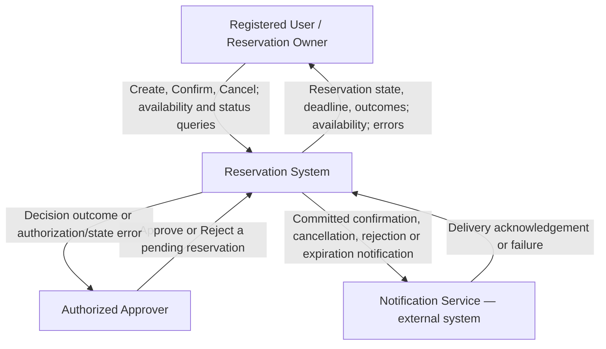
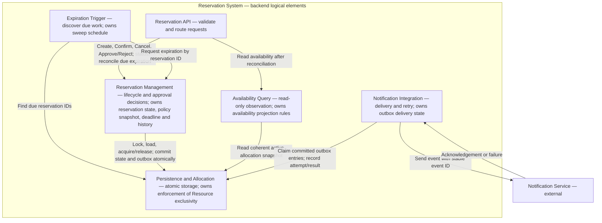
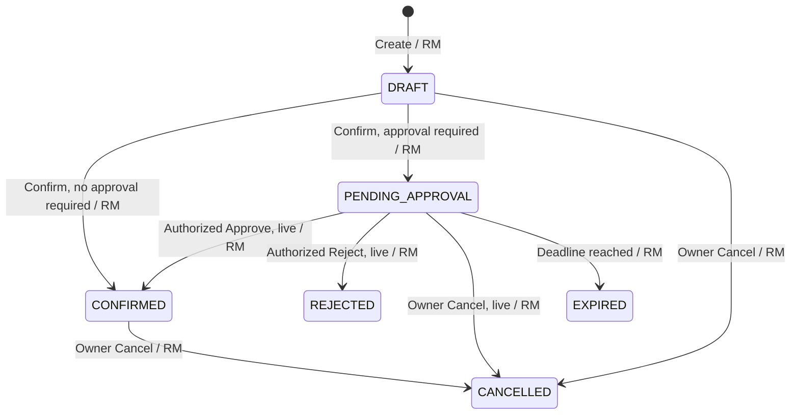
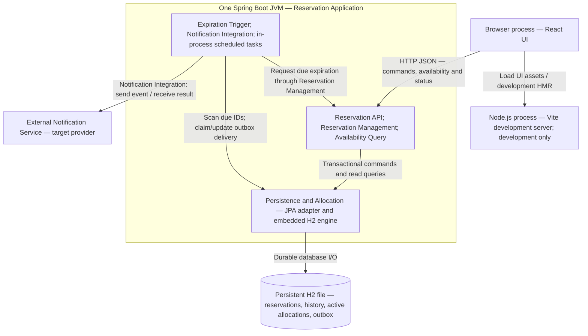
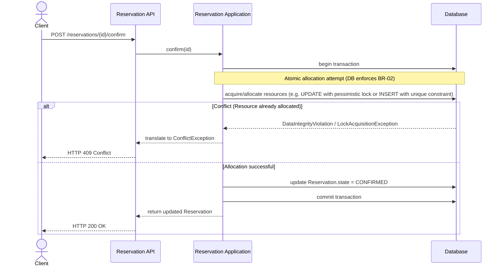

# C03 — Architecture

## B — Architectural Drivers

| Driver | Source | Why it affects the architecture | Question the architecture must answer |
|---|---|---|---|
| Atomic exclusive multi-seat allocation | BR-02, REQ-03, REQ-04 | Concurrent Confirm requests must not acquire the same Resource, and a multi-seat reservation must be allocated atomically without partial acquisition. | Where should the authoritative allocation decision be made so that BR-02 is preserved under concurrency? |
| Persistent delayed approval workflow | BR-07, BR-08, REQ-08–REQ-12 | A reservation may remain in PENDING_APPROVAL after the original request ends. The approval state, deadline, applicable policy and later decision must therefore persist across requests. | Who owns the pending approval state and performs later lifecycle transitions? |
| Reliable expiration and stale-decision protection | BR-06, BR-08, REQ-11 | A pending reservation must expire at its deadline and release its Resources. A delayed approval must not resurrect an expired or otherwise resolved reservation. | Who authoritatively determines expiration and how are stale approval decisions prevented from changing the reservation? |
| Lifecycle-aligned notifications | BR-09, Notification Service | Notifications are initiated only after successful lifecycle outcomes such as confirmation, cancellation, rejection or expiration. Failure of the external Notification Service must have clearly defined consequences. | Should notification failure affect a successful lifecycle transition, and who is responsible for delivery and retry? |


## C1 — Domain Model


## C2 — System Responsibilities

| Source | Responsibility | What it must decide / own | Needs one clear owner? | Reason |
|---|---|---|---|---|
| REQ-03, statechart | Manage reservation lifecycle | Valid reservation state transitions | Yes | Different parts of the system must not make conflicting lifecycle decisions |
| BR-02, REQ-04 | Evaluate allocation conflicts and preserve exclusive allocation | Resource acquisition/release and preservation of BR-02 | Yes | Concurrency must not cause double booking or partial multi-seat allocation |
| BR-07, REQ-08–REQ-10 | Manage approval decisions | Pending approval, authorization and approve/reject decisions | Yes | Approval is a delayed independent decision requiring clear authority |
| BR-08, REQ-11 | Manage pending expiration | Approval deadline and PENDING_APPROVAL → EXPIRED transition | Yes | Delayed processing must not allow late approval or an indefinite hold |
| REQ-02, BR-08 | Provide consistent Resource availability | AVAILABLE/UNAVAILABLE observation of active allocations | Yes | Availability must reflect pending holds, confirmed allocations and due expiration |
| BR-09 | Deliver lifecycle notifications | Notification delivery, failure handling and retry | According to design | External Notification Service failure must have explicitly defined consequences |

## D — Architecture Decision Question

**Decision question:**  
Where should the authoritative confirmation and Resource allocation decision be made so that BR-02 is preserved under concurrent Confirm requests?

## E1 — Architectural Alternatives

**Decision question:**  
Where should the authoritative confirmation and Resource allocation decision be made so that BR-02 is preserved under concurrent Confirm requests?

### Alternative A — Application-controlled allocation

The Reservation Application owns both the confirmation decision and the enforcement of exclusive Resource allocation. It checks for conflicts and performs the allocation and lifecycle transition within a transaction.

```text
[Client]
   |
   | Confirm Reservation
   v
+--------------------------------+
| Reservation Application        |
|                                |
| - confirmation decision        |
| - conflict check               |
| - Resource allocation          |
| - lifecycle transition         |
+---------------|----------------+
                |
                | read / write
                v
          [Database]
```

### Alternative B — Database-enforced exclusive allocation

The Reservation Application owns the confirmation workflow and reservation lifecycle, while the database is authoritative for enforcing exclusive Resource allocation. The application attempts to acquire the Resources atomically, and a conflicting acquisition is rejected by the database.

```text
[Client]
   |
   | Confirm Reservation
   v
+--------------------------------+
| Reservation Application        |
|                                |
| - confirmation workflow        |
| - lifecycle transition         |
+---------------|----------------+
                |
                | atomic allocation attempt
                v
+--------------------------------+
| Database                       |
|                                |
| - enforce Resource exclusivity |
| - reject conflicting acquire   |
+--------------------------------+
```
### E2 — Alternative Comparison

| Driver / Criterion | Alternative A — Application-controlled allocation | Alternative B — Database-enforced allocation |
|---|---|---|
| Atomic exclusive multi-seat allocation | The application checks conflicts and performs allocation in a transaction. Correctness therefore depends on the application using appropriate transaction isolation or locking for every allocation path. | The database enforces exclusive acquisition of Resources. Concurrent conflicting attempts cannot both successfully persist an active allocation. |
| Concurrency / BR-02 preservation | A read-then-write implementation can violate BR-02 unless concurrent Confirm requests are explicitly synchronized or locked. | BR-02 is protected at the persistence boundary where concurrent writes meet; a losing acquisition is rejected and translated to `409 Conflict`. |
| Lifecycle ownership | Confirmation logic and allocation decisions remain primarily in application logic, keeping the business workflow in one place. | The application owns the reservation lifecycle, while the database owns enforcement of Resource exclusivity. The ownership boundary must therefore be explicit. |
| Implementation complexity | Business logic is easier to understand in the application, but correct concurrency handling requires careful transaction and locking logic. | Requires persistence constraints/locking and translation of database conflicts into domain/API outcomes, but reduces the risk that another application path bypasses the exclusivity rule. |

## E3 — Scenario Walkthrough

**Scenario:** Two conflicting `DRAFT` reservations attempt to confirm the same Resource concurrently (C02 verification scenario V-09).

**Complication:** Concurrent `Confirm Reservation` requests.

| Step / Event | Alternative A — Application-controlled allocation | Alternative B — Database-enforced allocation |
|---|---|---|
| Two conflicting Confirm requests start | Both requests enter the Reservation Application, which is responsible for checking Resource conflicts. | Both requests enter the Reservation Application and attempt to acquire the same Resource. |
| Both requests evaluate the Resource | The application must coordinate the concurrent conflict checks using an appropriate transaction/isolation or locking mechanism so that both requests cannot observe and acquire the Resource successfully. | Both requests may attempt the allocation, but the database enforces Resource exclusivity at the persistence boundary. |
| First request acquires the Resource | The application completes the atomic allocation and changes the winning reservation to `CONFIRMED` or `PENDING_APPROVAL`. | The database accepts the first atomic allocation and the application changes the winning reservation to `CONFIRMED` or `PENDING_APPROVAL`. |
| Second request attempts the conflicting acquisition | The application must detect the conflict under its concurrency mechanism and reject the request with `409 Conflict`. | The database rejects the conflicting acquisition; the application translates the conflict into `409 Conflict`. |
| Multi-seat reservation contains a conflict | The application transaction must ensure that no subset of the requested Resources remains allocated when one Resource conflicts. | The database-backed atomic operation/transaction must roll back the complete acquisition when any requested Resource conflicts. |
| Result | BR-02 is preserved if every allocation path correctly uses the required application transaction/locking strategy. | BR-02 is enforced at the persistence boundary; conflicting writes cannot both create active allocations. |

## F — Architecture Decision Record

### ADR-01 — Authoritative Resource Allocation under Concurrent Confirmation

**Context:**  
Concurrent `Confirm Reservation` requests may attempt to acquire the same Resource. The system must preserve BR-02 so that a Resource cannot belong to more than one active `PENDING_APPROVAL` or `CONFIRMED` reservation. Multi-seat allocation must also be atomic, with no partial acquisition.

**Drivers:**
- Atomic exclusive multi-seat allocation.
- Preservation of BR-02 under concurrent Confirm requests.
- Clear ownership of the confirmation and allocation decision.
- Protection against allocation conflicts across concurrent lifecycle operations.

**Alternative A — Application-controlled allocation:**  
The Reservation Application checks allocation conflicts and is responsible for coordinating concurrent Resource acquisition using application-controlled transaction/isolation or locking.

**Alternative B — Database-enforced exclusive allocation:**  
The Reservation Application owns the confirmation workflow and lifecycle decision, while the database authoritatively enforces exclusive Resource allocation. Conflicting acquisition is rejected at the persistence boundary and translated by the application to `409 Conflict`.

**Decision:**  
Choose Alternative B — Database-enforced exclusive allocation.

**Reason:**  
BR-02 is a critical system invariant and must remain valid under concurrent requests. Enforcing Resource exclusivity at the persistence boundary prevents two conflicting writes from both creating active allocations. The Reservation Application remains responsible for the business workflow and lifecycle transition, while the database provides the final enforcement of allocation exclusivity.

**Accepted negative consequences:**
- Persistence logic becomes more closely coupled to the concurrency strategy.
- Database conflicts must be translated into appropriate domain/API outcomes such as `409 Conflict`.
- Multi-seat acquisition still requires a transaction so that a conflict cannot leave a partial allocation.
- Database-specific constraints or locking mechanisms may reduce portability.

**Reconsider when:**
- Resource allocation is moved across multiple independent databases or services.
- The selected database can no longer provide the required atomicity or concurrency guarantees.
- Performance or contention measurements show that the selected persistence strategy is a significant bottleneck.

## G — Architecture Views

**Scope and decision basis:** These TO-BE views realize **ADR-01 — Authoritative Resource Allocation under Concurrent Confirmation** in section F. The accepted alternative is **Alternative B**: Reservation Management owns confirmation and lifecycle decisions, while the database authoritatively enforces exclusive Resource allocation.

G2 specifies the proposed implementation of that decision and the supporting expiration and notification mechanisms. The outbox and scheduling details are supporting design choices described here, not decisions already stated in ADR-01.

These views describe the target architecture, not the current implementation. The C02 implementation uses a coarse screening lock and an after-commit logging notifier. Differences must be recorded in J, implemented where necessary in K, and verified in L.

Diagrams use fenced `mermaid` blocks that GitHub can render directly. G1, G2 and G4 use labelled structural block diagrams; G3 preserves the C02 lifecycle through a state diagram and an ownership table.

### G1 — System Context

The Reservation System is one black box. Its boundary includes the web UI, backend and persistence. Only external roles and the Notification Service contract appear outside it.



Being the reservation owner does not grant approval authority (BR-07). The Authorized Approver must have authority for all approval-required Resources in the reservation.

Expiration is an internal time-driven responsibility, not an external actor. Cinema administration is outside this reservation slice.

No identity provider is assumed. The current `X-User-Id` convention is a demo mechanism; trusted production identity remains unresolved.

Notification Service is a logical external boundary. The current demo logs notifications and does not run an external delivery provider.

### G2 — Static Architecture

Six logical elements group the responsibilities from C2. All application elements belong to one backend deployable; the design does not introduce microservices. Element names describe logical responsibilities rather than existing Java class names.



| Logical element | Main responsibility | Significant state / invariant owned |
|---|---|---|
| Reservation API | Validate transport input, pass caller identity, route commands/queries and map domain results to HTTP responses. | No lifecycle or allocation state. It cannot decide transitions or directly access persistence. |
| Reservation Management | Decide Create, Confirm, Cancel, Approve, Reject and Expire; enforce owner/Approver authority, time guards and retained policy; coordinate transactions. | Single decision owner of `Reservation.state`, pending request/policy/deadline, decision and outcome history; valid sequential lifecycle transitions (BR-03–BR-08). |
| Availability Query | Produce a coherent, read-only AVAILABLE/UNAVAILABLE observation for a screening. | Availability projection rules (REQ-02); no independent allocation store or state-changing permission. |
| Expiration Trigger | Periodically discover due pending IDs, including overdue work after restart, and request reconciliation. | Sweep scheduling only. Persisted deadlines and expiration decisions belong to Reservation Management. |
| Persistence and Allocation | Store reservations/history, enforce atomic multi-seat acquisition/release and provide locks, constraints and outbox persistence. | Database enforcement of BR-02; atomic commit/rollback of lifecycle, allocation and notification intent. It does not decide business eligibility. |
| Notification Integration | Dispatch committed lifecycle events through the external boundary and handle delivery failures/retries. | Delivery status, attempt count and next retry time; no authority over reservation lifecycle or allocation. |

#### Allocation mechanism realizing ADR-01

Retain reservation-seat membership for history and introduce a separate active-allocation relation with:

- A database-enforced unique key `(screening_id, seat_id)`.
- A reference to the reservation owning the allocation.

An active row represents either a pending hold or a confirmed allocation. Its meaning follows the owning reservation's state; there is no independent per-seat lifecycle.

Confirm inserts all selected Resources and updates the reservation in one transaction. A unique-key conflict rolls back the entire requested acquisition and is translated into `409 Conflict`. The losing draft acquires no subset of its requested seats.

An availability pre-check is informative and cannot authorize allocation. The database constraint is the final exclusivity enforcement point required by Alternative B.

Approval changes the owning reservation from PENDING_APPROVAL to CONFIRMED without deleting and reinserting its allocation rows. There is no release window.

Cancellation, rejection and expiration remove all active allocations **belonging to that reservation ID** while retaining reservation-seat membership and outcome history. A stale decision must never release Resources belonging to a later reservation (V-14).

The shared transaction must keep active-allocation rows and reservation state consistent. Uniqueness alone does not enforce that correspondence.

Lifecycle mutations lock and reload the reservation before evaluating current state and time guards. Operations involving multiple records must use one consistent lock order. Exact schema migration and lock ordering are implementation work for J–K and are not verified by this document.

#### Expiration and observations

Reservation Management is the only owner of expiration decisions.

Expiration Trigger runs inside the backend process and discovers due work from persisted pending deadlines. Persisted deadlines, rather than in-memory timers alone, allow overdue work to be rediscovered after restart.

Reservation Management samples the injected UTC clock after obtaining the relevant lock. At `now >= approvalDeadline`, a pending reservation must resolve to EXPIRED before a competing acquisition can succeed. Delayed sweep execution cannot permit late approval or rejection.

Independent due-expiration reconciliation commits separately from a subsequently rejected client command. Rolling back that command must not restore an expired hold.

Before an availability or status read, Reservation API requests system expiration reconciliation through Reservation Management.

The subsequent OP-02 availability query remains read-only. It uses a coherent snapshot and observation time, excluding pending holds already due at that time even if a deadline passed after reconciliation.

Every allocation attempt also reconciles due holders and rechecks authoritative state under locks. Correctness therefore does not depend on sweep punctuality or on a previous availability response (BR-08).

#### Notification failure policy

As a supporting TO-BE design choice, persist an outbox event in the same transaction as successful entry into CONFIRMED, CANCELLED, REJECTED or EXPIRED.

Pending submission and failed commands do not create final-outcome notifications.

Notification Integration reads committed outbox events and retries failed delivery with bounded backoff and a persisted next-attempt time. Provider failure does not undo a committed reservation transition.

Delivery follows an at-least-once strategy: a crash after provider acceptance but before acknowledgement storage may cause a duplicate send. A stable event ID enables deduplication when the provider supports it. Exactly-once delivery is not claimed.

This extends the current after-commit logging notifier. Outbox persistence, dispatch and retry require implementation and verification in J–L; they are not existing C02 capabilities.

#### Dependency rule

Only Reservation Management may request persisted lifecycle changes. All allocation writes go through Persistence and Allocation's transactional interface.

Reservation API, Expiration Trigger, Availability Query and Notification Integration cannot directly mutate `Reservation.state`.

External notification-client calls are confined to Notification Integration.

### G3 — State Transition Ownership

The statechart retains all transitions from Baseline v0.2.

**RM = Reservation Management**, the logical element from G2 and the decision owner on every edge. Guards are expanded in the ownership table. CANCELLED, REJECTED and EXPIRED have no outgoing transitions.



| Transition | Decision owner from G2 | Who may only request it | Required guards and atomic effect |
|---|---|---|---|
| Initial → DRAFT | Reservation Management | Registered User via Reservation API | Valid user/screening/seats and `now <= screening.startTime - 15 minutes`; persist intention and acquire no Resource (BR-03/05). |
| DRAFT → CONFIRMED | Reservation Management | Reservation owner via Reservation API | Owner, DRAFT, before screening, no Resource requires approval; database accepts all Resource acquisitions or the whole request rolls back (BR-02/05/07). |
| DRAFT → PENDING_APPROVAL | Reservation Management | Reservation owner via Reservation API | Same ownership/state/time and atomic acquisition checks; at least one Resource requires approval. Retain policy/authority snapshot, request time and finite deadline no later than screening start; hold all seats (BR-07/08). |
| PENDING_APPROVAL → CONFIRMED | Reservation Management | Authorized Approver via Reservation API | Authority covers all required Resources; still pending; `now < approvalDeadline` and `now < screening.startTime`. Convert the existing hold in place and record actor/time (BR-06–09). |
| PENDING_APPROVAL → REJECTED | Reservation Management | Authorized Approver via Reservation API | Same pending/authority/time guards; release all allocations and retain decision actor/time (BR-07–09). |
| DRAFT → CANCELLED | Reservation Management | Reservation owner via Reservation API | Owner and `now < screening.startTime`; retain cancellation time; no allocation to release (BR-04). |
| CONFIRMED → CANCELLED | Reservation Management | Reservation owner via Reservation API | Owner and `now < screening.startTime`; release all allocations and retain cancellation time (BR-04). |
| PENDING_APPROVAL → CANCELLED | Reservation Management | Reservation owner via Reservation API | Owner, before screening and still live pending; release all holds and retain cancellation time. If the deadline is already reached, system expiration applies instead (BR-04/06/08). |
| PENDING_APPROVAL → EXPIRED | Reservation Management | Expiration Trigger; Reservation API may request system reconciliation before reads; Reservation Management may discover due work while handling a command | Recheck pending state under lock and `now >= approvalDeadline`; release all holds, retain the outcome and effective deadline as expiration time (BR-08/09). No human expiration authority or public expiration endpoint. |

The Approver supplies a decision request. Reservation Management validates authority and eligibility before accepting it. Owning the reservation does not grant approval authority.

The database may reject an acquisition, but it does not independently choose APPROVE or REJECT. This preserves the ownership split accepted in ADR-01: application-owned lifecycle decisions and database-enforced allocation exclusivity.

No separate owner of approval lifecycle state is introduced. The pending request is part of the reservation lifecycle owned by Reservation Management.

Every transition, its allocation effect and relevant outbox intent commit atomically. Losing, repeated or stale commands cannot overwrite an outcome.

Unauthorized requests return `403`; invalid state or conflicting acquisition returns `409`. Independent system expiration is not a successful client-requested transition.

There is no DRAFT expiration, terminal-state reopening, partial confirmation or transition from PENDING_APPROVAL back to DRAFT.

### G4 — Runtime / Deployment

The TO-BE deployment retains one Spring Boot backend process and the local React/Vite setup.

H2 runs **embedded inside the backend JVM**, with a persistent database file. It is not a separate database server.

The active-allocation relation and outbox are target schema changes, not evidence of current implementation.



The browser-to-backend arrow represents the logical API route. Development routing may use a configured Vite proxy or an explicitly allowed browser origin. The supplied documents do not establish the current proxy configuration.

The local backend startup log from 2026-10-05 confirms HTTP port **8081**. The frontend API target must match the configured backend address. The C02 report records Vite on port 5173; the current frontend port has not been verified here. These are deployment configuration values rather than architectural invariants.

| G2 logical element | Runtime / deployable | Persistent state and restart behavior |
|---|---|---|
| Reservation API | Spring Boot JVM, HTTP request handlers | No authoritative state in the UI or request handler. |
| Reservation Management | Same Spring Boot JVM, application/domain logic | Reservation, pending policy/deadline and outcomes are reloaded from H2; requests do not own the pending workflow lifetime. |
| Availability Query | Same Spring Boot JVM, query logic | Reads authoritative persisted allocations/status; no independently writable availability cache. |
| Expiration Trigger | Same Spring Boot JVM, scheduled task | Rediscovers overdue pending reservations from persisted deadlines after restart; Reservation Management rechecks eligibility under lock. |
| Persistence and Allocation | JPA adapter plus embedded H2 engine in the same JVM | Persistent H2 file; the target unique active-allocation key and transaction boundaries enforce acquisition. |
| Notification Integration | Same Spring Boot JVM, outbox polling task and provider adapter | The target persisted outbox survives restart; failed or unacknowledged entries remain retryable. No separate worker process or message broker. |

#### Deployment limits and evidence boundary

This is a single-backend-instance local deployment, not a distributed production design.

While the backend is stopped, no local expiration sweep or notification dispatcher runs. After restart, overdue work is rediscovered, and incoming observations and commands still apply the deadline rules.

Production multi-instance database hosting, scheduler/outbox claiming coordination and trusted identity require further decisions.

The external Notification Service in G1, G2 and G4 is a target integration boundary. The C02 implementation evidence establishes only an in-process logging notifier, not a running external provider.

Durable outbox delivery and database-constrained allocation still require implementation and verification. Existing C02 test results are not evidence that these C03 additions already work.

#### Traceability and continuation

- **ADR-01 → G2:** Reservation Management owns lifecycle decisions; Persistence and Allocation enforces exclusive Resource acquisition at the database boundary.
- **C2 → G2:** Lifecycle, approval and expiration decisions have one owner; observation, scheduling, persistence enforcement and notification delivery have explicit separate responsibilities.
- **G2 → G3:** Every lifecycle transition is decided by Reservation Management. Actors and the scheduler may request transitions but cannot directly apply them.
- **G2 → G4:** Every logical element is mapped to the same backend JVM, including the embedded database engine and scheduled tasks.
- **G → H:** H1/H2 must reuse the logical owners and permitted dependencies defined here.
- **G → J–L:** Record differences from C02, implement required changes and verify behavior and architecture before claiming conformance.

## H — Scenario Realization

### H1 — Sequence Diagram

Diagram ukazuje, jak nová architektura řeší souběh pomocí databázového zámku nebo constraintu (vynucení BR-02 na úrovni DB).


### H1 — Sequence Diagram
### H2 — Design Class Diagram

## I — Cross-View Check

**Method and scope:** Static review of the supplied C03 document, Baseline v0.2 and repository snapshot `5688d630e2dd471e056de4d71aa424889f689406`. PASS below means consistency of the inspected material, not a passing application test. H is teammate-owned and remains unchanged.

| Required check | Finding | Status / next action |
|---|---|---|
| C02 ↔ G2 | Non-blocking drafts, whole-reservation pending/confirmed allocation, authority, strict deadlines and terminal outcomes are represented. Domain image C1 could not be retrieved for inspection. | Textual consistency checked; C1 visual review and behavior verification remain open. |
| C2 ↔ G2 | Six responsibilities map to explicit owners. Approval and expiration belong to the same logical Reservation Management owner; scheduling and delivery do not decide lifecycle. Grouping/separation is now explicit in C2. | PASS at design level. |
| G2 ↔ H1 | Current H1 uses Reservation Application and Database instead of an explicit mapping to Reservation Management and Persistence and Allocation. It leaves “lock or constraint” undecided although G selects active-allocation uniqueness. | OPEN — teammate must align participants/dependencies and the selected mechanism. |
| H1 ↔ H2 | H2 is not yet supplied. H1 uses a proposed `ConflictException` that does not exist in the reviewed code (`ReservationException` does). | OPEN — map every scenario operation and chosen exception/interface to H2 and J. |
| Statechart ↔ G3/H1 | G3 preserves the baseline edges. H1 currently always writes CONFIRMED, whereas E3/V-09 requires PENDING_APPROVAL for the winning approval-required reservation. The conflict branch omits explicit rollback. | OPEN — show policy guards, PENDING_APPROVAL and rollback of the whole acquisition; include the direct branch only if its guard is shown. |
| G2 ↔ G4 | All six logical elements map to one JVM, with embedded H2. Proxy and profile distinctions are now recorded. The external provider remains a target contract with a current logging stub. | PASS for target mapping; local port mismatch and restart proof remain open. |
| ADR ↔ G2/G4 | Alternative B is visible in the unique Resource allocation key and transactional persistence responsibility. Supporting outbox/expiration choices are recorded in F. | PASS at design level; implementation conformance remains open. |

### AS-IS corrections required before using Part A as evidence

| Item in `c03_part_a.md` | Verified correction |
|---|---|
| No explicit concurrency lock | `ScreeningRepository.findLockedById()` has `PESSIMISTIC_WRITE`; `ReservationService.lockedReservation()` obtains it before loading the reservation. |
| Synchronous HTTP `NotificationClient` | `NotificationService` is an after-commit transactional event listener that logs; there is no such HTTP client in the inspected backend. |
| `findConflicting()`, `ConflictException`, `confirmReservation()`, `getState()` | Actual names include `countOtherAllocations()`, `ReservationException`, controller `confirm()` and entity `getStatus()`. |
| Explicit save in Confirm | Confirm changes a managed entity; JPA persists it through transaction commit. |
| Example PostgreSQL storage | Configured storage is H2; default is file-backed and dev is in-memory. |
| BR-02 only mentions confirmed reservations | v0.2 includes PENDING_APPROVAL and CONFIRMED. |
| Placeholder citations and duplicate A7 | Replace `[cite: ...]` placeholders with actual source links; remove duplicate heading. |

These corrections are recorded here; the separate Part A file has not been edited by this document update. The motivation for ADR-01 must be stronger invariant enforcement, not the false claim that the existing code has no concurrency protection.

**H handoff:** Remove the duplicate H1 heading when completing H; use actor identity in Confirm, current lifecycle/time guards, an atomic acquisition transaction, explicit rollback on allocation conflict and the correct pending result for V-09. A generic lock failure is not automatically a proven business seat conflict: classify transient lock failures separately from the selected allocation-uniqueness violation. If showing notification intent, V-09's pending outcome must not create a final-confirmation event. H2 should contain the concrete interfaces/classes supporting those messages. This section records issues without editing the teammate's H content.

## J — AS-IS → TO-BE Delta

The action classification is relative to the target in F/G. Logical elements can contain multiple classes; matching component names does not require one class per component.

| ID | Area | AS-IS evidence | TO-BE | Action | Concrete completion criterion |
|---|---|---|---|---|---|
| J-01 | Exclusive acquisition | `ReservationService.confirm()` checks `countOtherAllocations()` under the screening lock; `reservation_seats` is unique only on `(reservation_id, seat_id)` | Separate active-allocation relation unique on `(screening_id, seat_id)` | CHANGE | DB rejects a competing active row even outside the ordinary conflict-check path; duplicate drafts remain valid. |
| J-02 | Atomic lifecycle/allocation writes | One reservation status determines blocking for every selected seat | Reservation state, all active rows and applicable outbox event commit or roll back together | CHANGE | A conflict on one requested seat leaves no partial allocation and no requested lifecycle/outbox change. |
| J-03 | Conversion and release | Status changes imply allocation conversion/release | Approval keeps the same active rows; terminal transitions delete rows by owning reservation ID and retain history | CHANGE | Old approval cannot affect a new reservation's allocation; all mixed seats release together. |
| J-04 | Conflict translation | Application raises `ReservationException(CONFLICT)` for detected collisions | Translate the specific allocation-uniqueness failure after transaction rollback; handle other persistence failures separately | CHANGE | API returns 409 for occupied Resources; no failed transaction is accidentally committed or reused. |
| J-05 | Notification delivery | `ApplicationEventPublisher` plus after-commit logging listener | Transactional outbox, in-process dispatcher, persisted retry state and stable event ID | CHANGE | Provider failure preserves business success; committed undelivered events survive restart and retry; pending creates no final-confirmation event. |
| J-06 | Lifecycle ownership | `ReservationService`, `ExpirationService` and the entity implement state transitions | Map service/expiration/policy logic into Reservation Management; keep scheduler outside this owner | VERIFY | H2 documents membership; scheduler and controllers do not directly call entity transition methods. No rewrite solely for naming. |
| J-07 | Expiration transactions | Pre-read expiration is separate; command-time expiration can share the command transaction with `noRollbackFor = ReservationException.class` | Independent due-expiration reconciliation survives a later failed acquisition; commands recheck state/time under locks | CHANGE | New DB-conflict rollback cannot restore an expired hold; deadline equality and stale decisions remain correct. |
| J-08 | Availability | `ReservationService.availability()` reads status-based allocation under the screening lock | Map query logic to Availability Query and read the authoritative target representation with due-aware semantics | CHANGE | Read-only observation is coherent with new active rows and deadlines; no independent allocation cache is introduced. |
| J-09 | Core baseline behavior | Draft, approval metadata, authority and terminal states already exist | Preserve BR-01–BR-09 and API outcomes | KEEP | Relevant regression scenarios pass after J-01–08. |
| J-10 | Runtime | One Spring Boot backend, React/Vite and embedded H2 | Same process model; persistent profile for recovery tests | KEEP | G4 and startup instructions identify profile, data lifetime and endpoints. |
| J-11 | Local routing | Committed Vite proxy targets 8080; observed backend run uses 8081 | Same backend address in both proxy entries and the running instance | CHANGE | Availability and reservation requests reach the intended backend; Vite restarted after configuration change. |
| J-12 | Architecture verification | No dedicated architecture check found | Reproducible controller/persistence dependency check in L2 | CHANGE | Save the supplied checker in the repository and run it after implementation; commit the checker and evidence. |

**Migration and locking constraints:** Preserve historical reservation-seat membership. Before backfilling active rows, reconcile expired pending records and detect any existing overlapping active ownership; do not silently discard conflicting history. Introduce the unique Resource key and backfill active rows through a controlled migration. Do not rely only on `ddl-auto: update` for this data transformation. Retain the coarse screening lock initially if it helps preserve valid lifecycle ordering; the new constraint still protects exclusivity. Specify one lock order in H/J before reducing lock granularity. H2's design must support J-01–08 before those implementation changes begin.

## K — Implementation Changes

**Actual status:** This task updates documentation and supplies/runs one bounded architecture check. No backend/frontend implementation, database migration, Git commit or push was performed. J-01–08 and J-11 remain implementation work; J-12's checker has been executed from the review workspace but is not yet installed in the repository.

| Work package | Required implementation | Current result |
|---|---|---|
| Allocation and transactions | J-01–04; schema/backfill, atomic acquire/convert/release and precise conflict mapping | NOT IMPLEMENTED |
| Expiration and query integration | J-06–08; owner mapping, independent expiration commit and coherent target reads | NOT IMPLEMENTED / mapping pending H2 |
| Notifications | J-05; outbox and dispatcher with controllable failure adapter | NOT IMPLEMENTED |
| Local routing | J-11; align chosen backend port and proxy | NOT CHANGED |
| Architecture check | J-12; install the L2 script and document its invocation | Executed in review workspace; repository integration pending |
| Build and regression verification | Backend package/tests, frontend lint/build and runtime checks | NOT RUN in this documentation task |

**Execution order:** Complete H and resolve I first; implement the migration and allocation transaction; integrate expiration/availability and outbox; resolve local configuration; run L1/L2; update M with actual output and the resulting commit/tag.

The review baseline is `5688d630e2dd471e056de4d71aa424889f689406`. It is not a C03 implementation completion commit. Record the actual implementation commit after the work is performed.

## L — Verification

### L1 — Behavior Verification

**Evidence distinction:** `c02-task14-report.md` records 60 passing backend test executions and successful build/UI verification on 2026-10-04. Those are historical C02 results. Source tests were inspected, but no fresh C03 behavior run is claimed. The review environment's Java launcher reports a missing `libjli.so`; backend execution was unavailable here.

| Verification / source | Required observable result | Existing check or new check needed | C03 execution result |
|---|---|---|---|
| Direct success, V-01 | 200, CONFIRMED, all seats allocated and final notification intent | Existing confirmation/notification tests and runtime flow A | NOT RUN |
| Pending and approval, V-02/04/15 | Whole mixed reservation pending; authorized approval retains the hold; no pending final-confirmation event | `mixedReservationHoldsAllSeatsAndApprovalPreservesHoldAndHistory` | NOT RUN |
| Conflict/concurrency, V-09/10 | One live pending winner, competing request 409 | `concurrentPendingConfirmationsHaveOneWinner` | NOT RUN |
| Multi-seat rollback, V-16 | One conflicting seat means no partial allocation | `mixedConflictDoesNotPartiallyAllocate`; add direct active-row assertions | NOT RUN |
| Authority, V-05 | Unauthorized decision returns 403 and performs no requested mutation | `unauthorizedAndInvalidDecisionsDoNotChangePendingOrHold` | NOT RUN |
| Deadline equality, V-07/13 | At the deadline: EXPIRED, release, late decision 409 | `approvalDeadlineBoundaryAndReadOnlyAvailability` | NOT RUN |
| Stale decisions, V-14 | Released seats may belong to a new reservation; old decision cannot affect them | `terminalReleaseIsAtomicAndStaleDecisionsCannotAffectNewAllocation` | NOT RUN |
| Concurrent lifecycle, V-11/12 | One valid sequential outcome, no resurrection | `approveRejectRaceHasOneDecisionAndOneNotification`, `approvalCancelRaceNeverResurrects` | NOT RUN |
| DB enforcement, J-01 | A duplicate active Resource write is rejected by the database itself | NEW: insert through a separate transaction bypassing the application pre-check; verify complete rollback | NOT IMPLEMENTED / NOT RUN |
| Expiration plus failed acquisition, J-07 | Independent expired hold stays released after a later acquisition conflict | NEW regression for the target transaction boundary | NOT IMPLEMENTED / NOT RUN |
| Notification failure and recovery, J-05 | Business state commits; event stays retryable; retry uses stable ID; rollback/pending produces no final event | NEW failing-adapter, transaction and persistent restart checks | NOT IMPLEMENTED / NOT RUN |
| Persistent deadline recovery | Overdue pending request is rediscovered after process restart | NEW restart check with file-backed test DB; not `dev` create-drop | NOT RUN |

Run from the repository root on Windows after implementation:

```powershell
Push-Location backend
.\mvnw.cmd clean package
Pop-Location
Push-Location frontend
npm.cmd ci
npm.cmd run lint
npm.cmd run build
Pop-Location
```

After starting a backend with suitable demo data and a matching frontend proxy, the existing API script can target the actual port:

```powershell
Push-Location backend
.\verify-baseline.ps1 -BaseUrl http://localhost:8081
Pop-Location
```

Use `node frontend/verify-ui.mjs` only after satisfying its documented browser-debugging and running-app prerequisites. Preserve actual output in the evidence record. Do not mark rows PASS merely because the commands or old tests exist.

### L2 — Architecture Conformance Rule

**Rule:** Reservation API controller source files must not directly depend on project repositories, Spring Data/JDBC, JPA persistence APIs or JDBC APIs. Controllers route requests through application services, consistent with the API → Reservation Management / Availability Query dependencies in G2.

**Repeatable check:** Save the following as `backend/check_architecture.py`. From the repository root run `python backend/check_architecture.py .` (or `py -3 backend/check_architecture.py .` on Windows).

```python
from pathlib import Path
import re
import sys

root = Path(sys.argv[1]) if len(sys.argv) == 2 else Path('.')
controllers = root / 'backend/src/main/java/com/reservedbytes/cinema_reservation/controller'
files = sorted(controllers.rglob('*.java'))
if not files:
    raise SystemExit('FAIL: no controller Java files found; pass the repository root.')
forbidden = re.compile(
    r'\bcom\s*\.\s*reservedbytes\s*\.\s*cinema_reservation\s*\.\s*repository\b'
    r'|\borg\s*\.\s*springframework\s*\.\s*(?:jdbc|data)\b'
    r'|\b(?:jakarta|javax)\s*\.\s*persistence\b'
    r'|\bjava\s*\.\s*sql\b'
)
violations = []
for file in files:
    source = file.read_text(encoding='utf-8')
    source = re.sub(r'/\*.*?\*/|//[^\n]*', '', source, flags=re.S)
    if forbidden.search(source):
        violations.append(str(file.relative_to(root)))
if violations:
    print('FAIL: direct persistence dependency in controllers:')
    print('\n'.join(violations))
    raise SystemExit(1)
print(f'PASS: {len(files)} controller files; no direct persistence dependencies.')
```

**Observed result, 2026-10-05:** Executed the exact checker above against repository snapshot `5688d630e2dd471e056de4d71aa424889f689406` from the review workspace; exit code 0:

```text
PASS: 2 controller files; no direct persistence dependencies.
```

**Scope:** This is a bounded source dependency check covering `ReservationController` and `AvailabilityController`, including fully qualified references to the listed persistence packages. It is not a Java type resolver and does not prove allocation correctness, indirect/reflection-based access, all lifecycle ownership or full G2 conformance. Install it in the repository and rerun it on the final implementation commit. This existing satisfied boundary is an architectural rule from G2 even though other target changes remain incomplete.

## M — Evidence

The following evidence entry is ready to append to `docs/evidence-and-evolution.md` after this document is installed as `docs/c03.md`. It records the actual current state; the separate evidence file has not been updated by this document-only task.

### C03 — Architecture Evidence

**Baseline:** [C02 Specification Baseline v0.2](c02_baseline_specification_v0.2.md).

**Review source commit:** `5688d630e2dd471e056de4d71aa424889f689406`.

**Part A:** [AS-IS mapping](c03_part_a.md); source review found incorrect claims about missing locks, HTTP notifications, method names and database configuration. See [cross-view findings](c03.md#i--cross-view-check). Part A corrections remain to be applied to that file.

**Drivers:** [B](c03.md#b--architectural-drivers): atomic exclusive allocation, persistent delayed approval, reliable expiration/stale-decision protection and lifecycle-aligned notifications.

**Decision question:** [D](c03.md#d--architecture-decision-question): authoritative confirmation/allocation under concurrent requests.

**Alternatives and walkthrough:** [E1](c03.md#e1--architectural-alternatives), E2 and [E3](c03.md#e3--scenario-walkthrough): application-controlled locking/checking versus database-enforced exclusivity; common approval-required V-09 scenario.

**ADR:** [F](c03.md#f--architecture-decision-record), ADR-01 selects Alternative B. Supporting target choices specify active allocations, expiration coordination, local runtime and transactional outbox.

**Views:**

| View | Location | Review status |
|---|---|---|
| Domain class | C1 | External image present; content not visually verified in this review |
| System context | G1 | Documented |
| Static architecture | G2 | Documented target; not yet implemented in full |
| State ownership | G3 | Textually checked against baseline transitions |
| Runtime/deployment | G4 | Profiles/proxy documented; local port mismatch recorded |
| Design sequence | H1 | Teammate-owned work in progress; I records open issues |
| Focused design class | H2 | Teammate-owned work pending |

**Cross-view issues found/resolved:** C2 grouping/separation added; E2 criteria tied to B; V-09 pending outcome clarified; supporting choices linked to F; proxy and H2 profile evidence corrected. H alignment, C1 inspection and corrections to the separate Part A file remain open.

**AS-IS → TO-BE delta:** [J](c03.md#j--as-is--to-be-delta), J-01–J-12 specify CHANGE, KEEP and VERIFY work.

**Implementation changes:** No backend/frontend/migration changes in this documentation task. K records pending work. Historical C02 functionality is not relabelled as completed C03 implementation.

**Behavior verification:** No new behavior execution; L1 identifies existing regression tests and required new target checks. Historical C02 test results remain attributed to [Task 14](c02-task14-report.md).

**Architecture conformance rule + result:** L2 checks that controllers do not directly depend on persistence APIs. Exact script executed against the review source commit: PASS, 2 controller files, exit code 0. Repository installation and rerun on the implementation commit remain pending.

**Remaining uncertainty / risk:** H1/H2 completion; C1 image review; correction of Part A; allocation schema/backfill and rollback semantics; deadline reconciliation; outbox implementation/retry and persistent recovery evidence; local port alignment. Production identity, provider selection and multi-instance deployment remain outside the demonstrated local slice.

**Commit/tag:** No new commit/tag or push was created. Record the actual documentation and implementation commits when committed; do not use the reviewed source commit as evidence of completed target changes.
